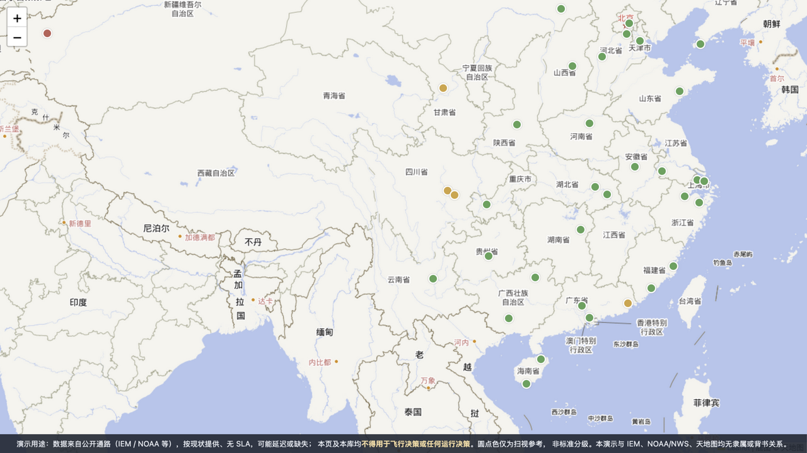
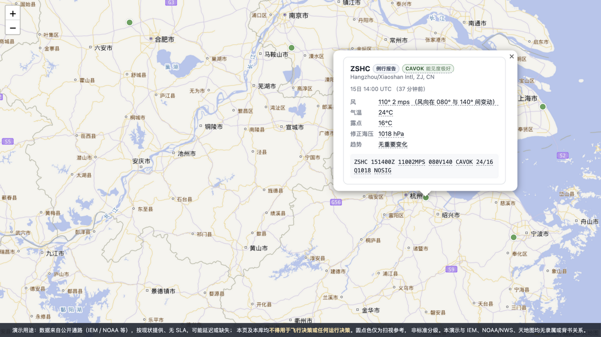

<div align="center">

# metweave

**把公开气象数据编织成可嵌入产品的图。**

TypeScript 工具链：解析 → 标准化 → 渲染

**几行代码，把公开报文画上地图（底图自备）。**

[](LICENSE)
[](https://github.com/yaojaro/metweave/actions/workflows/ci.yml)

</div>

---

**metweave** 是一套处理公开气象数据的 TypeScript 工具链：机场报文（METAR / SPECI，TAF 在路线图上）经「解析 → 标准化 → 渲染」一条管道，变成报文卡片与地图图层。SPECI 是机场出现显著天气变化时插发的特殊观测报文，格式与 METAR 相同。取数直连公开源——IEM（Iowa Environmental Mesonet，美国爱荷华大学的公益气象数据聚合服务）的实况端点 CORS 全开，浏览器可直连；解析与渲染全部在浏览器端完成，报文不经过你自己的服务器，无需自建后端。

> **30 秒认识 METAR**：METAR 是机场每小时（部分机场每半小时）发布的一行天气观测电码——`ZSPD 120330Z 04004MPS 9999 SCT033 27/18 Q1020 NOSIG` 依次是站名、时间（UTC）、风、能见度、云、温度/露点、气压、趋势。metweave 做的事，就是把这一行变成结构化数据和界面。





### 为什么是 metweave

气象报文的解析层已经有很多优秀的开源库（avwx、MetPy……）。metweave 不重复造这些轮子——真正的缺口在解析之后：今天要把一张 METAR 报文卡片或一层格点填色画到地图上，你仍然要在格式转换、互不相干的渲染插件和自写胶水代码之间挣扎。气象前端缺的不是又一个图层库，而是把**解析 → 标准化 → 渲染**连成一条完整链路的那一层。metweave 想做的，就是这一层。

- 解析侧的纪律是**不静默**：看不懂的组进 `warnings[]`（带原文位置），缺测电码（`//`、`////`、`/////KT`、`BKN///`）显式建模为三态，绝不丢弃、绝不捏造值。
- 失败有稳定契约：解析/取数失败抛 `MetarParseError` / `MetarSourceError`，`code` 字段只增不改，消费方按 code 分流。**`message` 默认中文**（v0.1 主受众）——英文文案用 `@metweave/core` 导出的 `EN_MESSAGES[code]` 查表，全部错误码清单见 [docs/error-codes.md](docs/error-codes.md)。日志采集提示：错误对象的机读明细在 `raw` 字段（如批量失败的逐站汇总），`message` 是给人看的中文——只采 message 会丢明细。
- 英文展示现成可用：卡片与地图图层传 `locale: "en"` 整卡切换——`renderCard(report, { locale: "en" })` 或 `addMetarLayer(map, items, { locale: "en" })`（速记等价 `card.locale`，卡片/悬停/读屏档位词一并切换）；告警按 code 映射英文模板。云底/垂直能见度的正面单位随语言：中文米（民航口径）、英文英尺（报文原生编码），`heightUnit` 选项可显式覆盖。

### 安装

```bash
npm install metweave @metweave/leaflet leaflet
# TypeScript 用户另装类型：npm install -D @types/leaflet
```

**从源码编译**（参与开发或需改源码时）：

```bash
git clone https://github.com/yaojaro/metweave.git
cd metweave && pnpm install && pnpm build
# 先看效果：一条命令起官方示例，浏览器打开提示的本地地址
pnpm --filter metweave-examples dev
# 用在自己的项目：五个包打成 tgz 后连同 leaflet 一起安装（workspace 依赖需 tgz 齐上）
pnpm -r --filter '!metweave-monorepo' --filter '!metweave-examples' pack --pack-destination ./dist-pkg/
cd 你的项目 && npm install ~/metweave/dist-pkg/metweave-*.tgz leaflet
```

> 团队协作提示：tgz 方式会把 `file:` 路径写进 package.json（路径移动即断）——建议把五个 tgz 提交到内网 registry、随仓 vendored，或统一放在仓库内的固定相对路径再安装。

### 快速开始：底图自备，几行代码上图

以下示例运行在浏览器项目（Vite/webpack）；Node 环境先看下方「Node 里的三十秒」。

**底图用天地图，需要你自己的 key**——天地图服务条款要求按应用申请 key，所以本项目不自带、也不代发。到 <https://console.tianditu.gov.cn/> 申请「浏览器端」类型的 tk，放进环境变量（Vite 项目写 `.env.local` 的 `VITE_TIANDITU_KEY`）：**不要把 key 写进代码，也不要用 URL 参数传**——key 一旦进地址栏，就会留在浏览器历史、Referer 头与中间层日志里。**没配置 key 时会看到什么**：天地图对无 key 请求返回拦截页而非瓦片，表现是地图区域空白、控制台出现非图片响应——metweave 不会静默替换成其他底图源；国内无免 key 的公开瓦片可用（OSM 国内不可达），**申请 key 是地图环节的硬前置**（官方示例在无 key 时会就地提示配置方式）。

HTML 里放一个地图容器：`<div id="map" style="height: 420px"></div>`，然后（用 `npm create vite` 新建的项目，先删掉模板自带的演示文件与引用——`counter.js` / `style.css`，新版模板还有 `assets/` 下的图片等，避免样式互相干扰）。**Vue 项目注意**：示例的顶层 `await` 在 Vue3 `<script setup>` 中需要外层 `<Suspense>` 包裹，否则页面空白——或者改用 `.then()` 风格调用：

```ts
import * as L from "leaflet";
import "leaflet/dist/leaflet.css"; // 别漏：不引入 CSS 地图不渲染（瓦片错位、控件散架）
import { getMetarReports } from "metweave/sources";
import { addMetarLayer } from "@metweave/leaflet";

const map = L.map("map", { center: [35.5, 105], zoom: 4 });
const tk = import.meta.env.VITE_TIANDITU_KEY; // 你自己的天地图浏览器端 key
L.tileLayer(
  `https://t{s}.tianditu.gov.cn/vec_w/wmts?SERVICE=WMTS&REQUEST=GetTile&VERSION=1.0.0&LAYER=vec&STYLE=default&TILEMATRIXSET=w&FORMAT=tiles&TILEMATRIX={z}&TILEROW={y}&TILECOL={x}&tk=${tk}`,
  { subdomains: ["0", "1", "2", "3", "4", "5", "6", "7"], attribution: "底图 © 天地图" },
).addTo(map);
await addMetarLayer(map, await getMetarReports(), { conditionColors: true });
```

- **底图与 metweave 解耦**：上面这行 `L.tileLayer(...)` 只是底图来源，换成任意你已获授权的瓦片源即可——metweave 不绑定任何底图厂商，也不代你取得底图许可。含中文注记层的完整两层写法见 [`examples/src/basemaps.ts`](examples/src/basemaps.ts)。
- **中国区外的即拷即用底图（无需申请 key）**：把天地图那行换成 OpenStreetMap——`L.tileLayer("https://tile.openstreetmap.org/{z}/{x}/{y}.png", { attribution: "© OpenStreetMap contributors", maxZoom: 19 }).addTo(map)`；注意 `attribution` 要换成你实际所用底图方的署名（上例的「底图 © 天地图」字面量是天地图专用），重度流量请按 OSM 瓦片使用政策自托管或改用商用瓦片源。
- **为什么示例默认开 `conditionColors: true`（条件色圆点模式）**：Leaflet 默认图钉的图标 URL 在打包器（Vite/webpack 等）下会 404（图标路径按 CSS 推断，会被打散），而圆点模式纯 CSS 绘制、无图标资源，默认就不踩坑。若你偏好默认图钉，补一行固定图标 URL 即可：`L.Icon.Default.mergeOptions({ iconUrl: "https://unpkg.com/leaflet@1.9.4/dist/images/marker-icon.png" })`。

- 缺省拉取中国 ASOS 网（ASOS＝Automated Surface Observing System，自动地面观测站网；39 站）整网实况；换网传 IEM 网名——国家网 = ISO 国家码 + `__ASOS`（如 `DE__ASOS`、`RU__ASOS`），美国州网为单下划线（`IA_ASOS` / `CO_ASOS`），完整清单见 [IEM](https://mesonet.agron.iastate.edu/sites/networks.php)。
- 站点定位与坐标系：IEM 自带的中国站坐标为城市级粗定位（与 WGS-84，即 GPS 所用坐标系，存在城市级误差）——放大视图请以机场实际位置为准；严肃场景请用 `stations` 参数传站点元数据精确联表（「联表」＝按 ICAO 四字码把报文和你的站点元数据表对号入座，做法可抄 [`examples/stations.json`](examples/stations.json)）。
- 完整可跑示例（站点元数据定位、RAW 对照卡片）见 [`examples/`](examples/)，`pnpm install && pnpm --filter metweave-examples dev` 一条命令起 demo（同样需要自备天地图 key）。

### Node 里的三十秒

浏览器能跑完整链路（取数 → 解析 → 卡片 → 地图）；Node ≥ 20（ESM，top-level await——脚本存成 `.mjs`，或项目 package.json 设 `"type": "module"`）适合取数、解析与 IR 消费（IR＝解析产物的结构化数据模型，Intermediate Representation）——渲染组件依赖 DOM。

**手里已有报文（离线/历史/自抓的 METAR 字符串）**，用解析入口 `parse` 三行起步：

```ts
import { parse, toValues } from "metweave";
const report = parse("ZSPD 120330Z 04004MPS 9999 SCT033 27/18 Q1020 NOSIG");
console.log(toValues(report).temperature?.celsius, report.warnings); // 值 + 解析告警（不静默纪律）
```

**从公开源取实况**（`getMetarReports` 返回的每一项是 `{ report, position, title }`——坐标 `[lat, lon]` 与站点标题；报文原文在 `report.raw` 原样保真）。风速值与单位成对展示——小白也能看懂 4 是 4 mps（单位跟组走）：

```ts
import { toValues } from "metweave";
import { getMetarReports } from "metweave/sources";
const items = await getMetarReports("CN__ASOS");
console.table(
  items.map(({ report, title }) => {
    const { temperature, wind } = toValues(report);
    return {
      站: title,
      温: temperature?.celsius,
      风: wind && `${wind.speed.value} ${wind.speed.unit}`,
    };
  }),
);
```

**常用字段速查**（`toValues(report)` 的两态视图：缺测与组省略同为 `undefined`，需细分「明示缺测 vs 未报」时直接消费 IR 的三态与 `warnings`）：

| 你想要      | 取值路径                                                                          | 说明                                                                        |
| ----------- | --------------------------------------------------------------------------------- | --------------------------------------------------------------------------- |
| 站名 / 原文 | `report.station` / `report.raw`                                                   | 四字码 / 原文保真                                                           |
| 观测时刻    | `report.time.{day,hour,minute}`                                                   | UTC；无年月                                                                 |
| 气温 / 露点 | `v.temperature?.celsius` / `v.dewpoint?.celsius`                                  | 摄氏度                                                                      |
| 风          | `v.wind?.direction` `v.wind?.speed.{value,unit}`                                  | 单位跟组走（kt/mps/kmh）；`direction:null`＝风向不定                        |
| 阵风        | `v.wind?.gust?.{value,unit}`                                                      | 缺省无阵风                                                                  |
| 能见度      | `v.visibility?.{value,unit,exact,beyond}`                                         | `exact:false`＝阈值编码（9999→≥10km 等，方向看 `beyond`）                   |
| 天气        | `v.weather`（数组，元素含 `intensity/descriptor/phenomena`）                      | 空数组＝无重要天气                                                          |
| 云          | `v.clouds?.elements`（`amount` + `heightFt.value` 英尺）/ `v.clouds?.clear?.code` | `heightFt.value:null`＝云底缺测；CAVOK 时三组让位                           |
| QNH         | `v.altimeter?.{value,unit}`                                                       | hPa 或 inHg（单位跟组走）                                                   |
| 趋势        | `v.trends`（`kind`/`period`/`raw`）                                               | NOSIG/BECMG/TEMPO                                                           |
| 告警        | `report.warnings`（`code`/`severity`/`span`/`message`）                           | 恒存在；按 `code` 分流，全部码见 [docs/error-codes.md](docs/error-codes.md) |

> 表格首列现在还是 ICAO 四字码——因为缺省没传站点元数据。**中国 39 站的精确元数据已随包自带**：`import { CN_STATIONS } from "metweave/stations-cn"` 后传给 `getMetarReports("CN__ASOS", { stations: CN_STATIONS })`，`title` 就会变成「四字码 + 站名」、坐标换为精确机场位（数据来源 aviationweather.gov，`pnpm gen:stations` 可再生；自建联表可照 [`examples/stations.json`](examples/stations.json) 的结构）。

### 数据源与风险披露

metweave 的取数通路面向公开数据源，适合**态势感知、原型与教学**，不适合进入运行决策链：

- **IEM（Iowa Environmental Mesonet）是大学公益聚合器**，不是官方分发渠道：数据按「现状」提供（as-is），无 SLA，限流策略未知，时效以源站为准（典型龄期 20–50 分钟）。
- IEM 通路**无法区分 SPECI 与 METAR**（一律按例行展示）；中国站自带坐标为城市级粗定位，严肃场景请用 `stations` 联表精确坐标（方案见上）。
- 底图：示例用天地图（官方 WMTS 端点），**key 需你自行申请**——天地图服务条款要求按应用申请 key，本项目不代发 key、不代理底图服务，也不对底图内容的合规性负责。商用请按底图服务方条款取得授权。
- **观测数据本身的定位**：METAR 报文经公开通路（IEM / NWS tgftp 等）再分发——属公益公开通路、非官方再分发渠道；商用前请自行核实数据提供方的分发条款。

### 规范遵循与数据验证

解析器以六套规范**原文**为编码基准，METAR/SPECI 编码面 106 条条款已逐条做过符合性审计（逐条的规范出处、实现位置与回归锁见 [docs/compliance.md](docs/compliance.md) 审计矩阵），未满足项零容忍修复：

| 规范                                                                      | 在本库中的用途               |
| ------------------------------------------------------------------------- | ---------------------------- |
| WMO No. 306 Vol I.1（FM 15 METAR/SPECI）+ 电码表 0919/0519/1079/0366/4678 | 国际电码主干                 |
| ICAO Annex 3《航空气象服务》                                              | 报文模板与要素清单           |
| 中国民航《民用航空气象地面观测规范》（AP-117-TM-2021-01R2）               | 中国区编报细则、中文术语出处 |
| 中国民航《民用航空飞行气象情报发布与交换办法》（AP-117-TM-01R2）          | 发布与交换相关条款           |
| 美国 FMH-1《地面观测手册》                                                | RMK 国家附加组               |
| 加拿大 MANOPS-MET                                                         | 加式形态（////SM 等）        |

数据验证四道防线，全部可复现：

- **真实语料回放**：2,300+ 条全球真实报文（2,400+ 行，多国网络采样）快照基线，未知形态与告警分布漂移即红——`pnpm run replay:corpus`
- **模糊测试**：种子化变异 5 万例（CI 每夜 10 万档）断言十一项产物不变量——永不崩溃、raw 保真、span 永不越界、两次解析逐字节一致、IR 数值域无非有限值——`pnpm fuzz`
- **单元与夹具**：290+ 测试，每类反常形态至少一条真实夹具；修复一律带回归锁，且锁必须先通过「突变验证」（能拦住人为破坏才算数）
- **语义交叉校验**：温露倒挂、CAVOK 与能见度/RVR/天气/云矛盾、QNH 超世界极值、重复组、VV 与云层并存等矛盾形态全部出声

解析纪律（IR 契约，见 [`packages/core/src/ir.ts`](packages/core/src/ir.ts)）：缺测三态（组省略 ≠ 缺测 ≠ 有值）绝不混用；越界值判缺测绝不留假值；看不懂的组进 `warnings[]` 并携带原文 span，原码永远可回溯。

诚实声明：中国民航规范以官方现行 R2 版为准；FMH-1 与 MANOPS 的最新版原文未完全公开可取，相关条款以可获得的官方文本引证并用真实语料互证。

### 包结构

> 新手可以忽略本节——日常消费用 `toValues()` 即可拿到两态字段视图；本节面向需要理解管道契约与包边界的进阶场景。

| 包                                      | 职责                                                                           |
| --------------------------------------- | ------------------------------------------------------------------------------ |
| [`@metweave/core`](packages/core)       | IR 数据模型（管道稳定契约）：组级三态缺测、原文 span、告警、两态取值视图       |
| [`@metweave/parser`](packages/parser)   | METAR/SPECI tolerant 解析 → IR；未知组与缺测一律不静默                         |
| [`@metweave/render`](packages/render)   | 报文卡片：零框架 DOM 组件，内置样式与 RAW 对照视图（缺测/告警高亮 + 悬停解释） |
| [`@metweave/leaflet`](packages/leaflet) | Leaflet 适配器：报文卡片上图（marker + tooltip + 卡片弹窗）                    |
| [`metweave`](packages/metweave)         | 伞包：再导出 core/parser/render；`metweave/sources` 提供取数 helper            |

### 当前状态

版本政策（v0.x）：

- v0.x 期间遵循 semver 前期惯例：minor（0.x）即可能引入破坏性变更，升级前请看 [CHANGELOG](CHANGELOG.md)。
- 五包锁步同版本：`@metweave/*` 与 `metweave` 永远同一版本号一起发布（由 `pnpm check:workspace` 把关）。
- IR 新增 optional 字段属 additive，不算破坏性变更（契约见 [`packages/core/src/ir.ts`](packages/core/src/ir.ts)）；告警/错误 `code` 同理只增不改。

已交付：

- METAR/SPECI tolerant 解析器——真实公开报文夹具验收（每类反常形态至少一条真实样本）：未知组进 `warnings[]`、缺测电码三态（`//` 天气、`////` 能见度、`/////KT` 风、云组 `///` 各归其位）、单位跟组走、脏值（超界 QNH）判缺测并告警、跑道状态组（WMO 15.13.6 六位电码 / CLRD / SNOCLO）、语义交叉校验（温露倒挂、CAVOK 矛盾）
- IR 数据模型：解析器与渲染组件之间的唯一契约，纯 JSON 可序列化，一切产物携带原文 span
- 报文卡片：开箱默认样式、RAW 对照视图、内置中文术语表
- Leaflet 适配器与端到端示例：公开报文 → 解析 → 地图，[`examples/`](examples/) 可跑
- 仓内 fuzz 套件：种子化变异回放 + 十一项产物契约不变量（`pnpm fuzz`，CI 每夜 10 万例档）

方向：

- 解析覆盖面：TAF、strict 校验模式
- 图表组件：格点填色、等值线、风羽与流线、meteogram（Canvas 2D 优先渲染内核）
- 更多地图库适配（MapLibre 等）、IWXXM ↔ TAC 转换、中文底图配方表

### 参与

本项目目前由作者独立维护，**暂不接受外部代码贡献**（PR 暂不开放）；问题反馈欢迎开 issue（模板见 [`.github/`](.github/)），安全问题请走 [SECURITY](SECURITY.md) 的私密渠道。开放贡献后，[CONTRIBUTING](CONTRIBUTING.md) 将更新为完整指南。

### 联系

邮箱 [yaojaro@metweave.com](mailto:yaojaro@metweave.com) · GitHub [@yaojaro](https://github.com/yaojaro)

作者 YaoJaro，长期从事民航气象数据处理与 WebGIS 可视化。

### 许可

**代码**：[MIT](LICENSE) © 2026 YaoJaro——授权范围**仅限本仓库的源代码与文档**。

**数据不在 MIT 授权范围内。** 仓库内 `corpus/` 与 `packages/parser/src/__fixtures__/` 收录的报文样本是公开通路的再分发数据，权利状态由上游决定；本项目**不对这些报文主张任何版权**，MIT 授权也不覆盖它们：

- 来源之一 **IEM（Iowa Environmental Mesonet，爱荷华州立大学）**：其站点声明所提供材料属公有领域、可供任何人自由用于合法用途，并希望使用者署名爱荷华州立大学 IEM。
- 来源之一 **美国 NOAA / NWS**：其网站信息除特别注明外属公有领域，可免费用于合法用途；但不得声称为自己所有、不得暗示与 NOAA/NWS 存在背书或隶属关系、不得修改后作为官方材料呈现。
- 样本入库只为解析器测试的可复现性。**商用前请自行核实各数据提供方的分发条款**（见上文「数据源与风险披露」）。

**无隶属关系**：本项目与 Iowa State University / IEM、NOAA / NWS、中国气象局、中国民用航空局及天地图运营方均无隶属、合作或背书关系；文中出现的机构名与产品名仅用于指称与说明。
